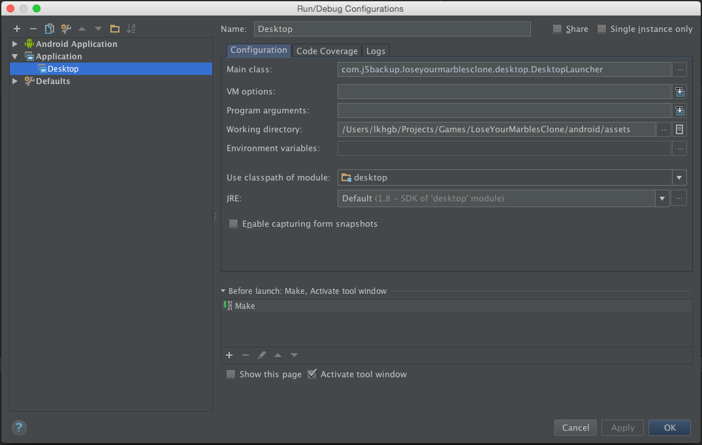

LoseYourMarblesClone
====================

This project is a partial remake of SegaSoft's 1997 puzzle game, Lose Your Marbles. It is written in Java using the game development framework libGDX and includes an Android Studio project ( https://github.com/libgdx/libgdx/wiki/Gradle-and-Intellij-IDEA ).

For the desktop build the following screenshot shows a quick example reference for a Run Configuration.

The source code was written for learning purposes and is released under the BSD-3 license, as specified in the included LICENSE file.

The art, sound, and music assets were created specifically for the game and are released under the Creative Commons Attribution By license (CC Attribution BY), as specified in the included LICENSE file.

NOTE: Some issues with the game's sound have been noticed in the android simulator that were not present using the older version this project was originally developed on. These issues are not exhibited in the desktop version.

Have fun losing your marbles with this project.